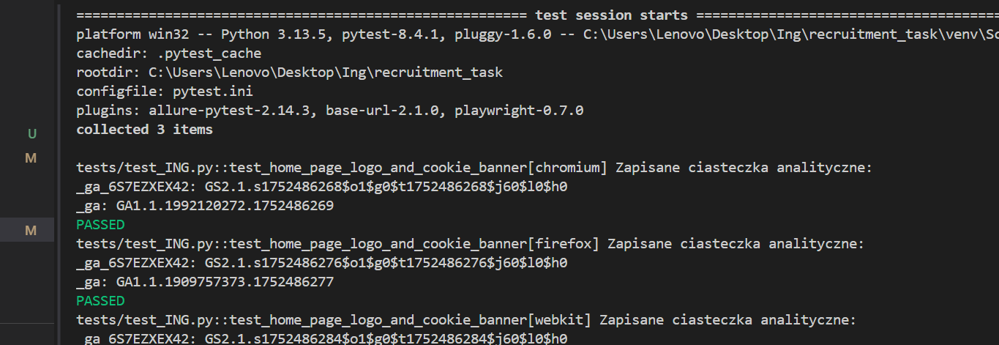
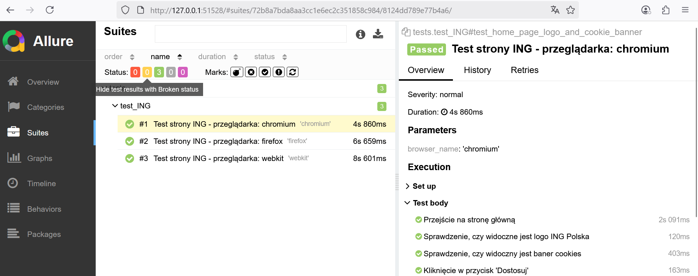
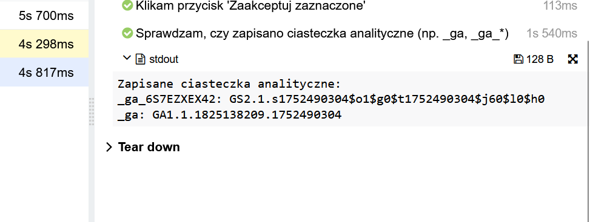
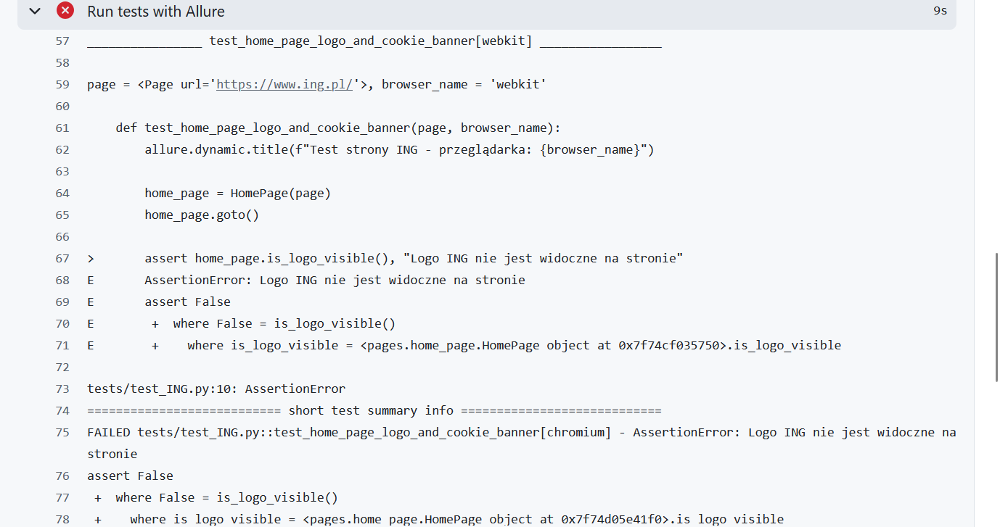
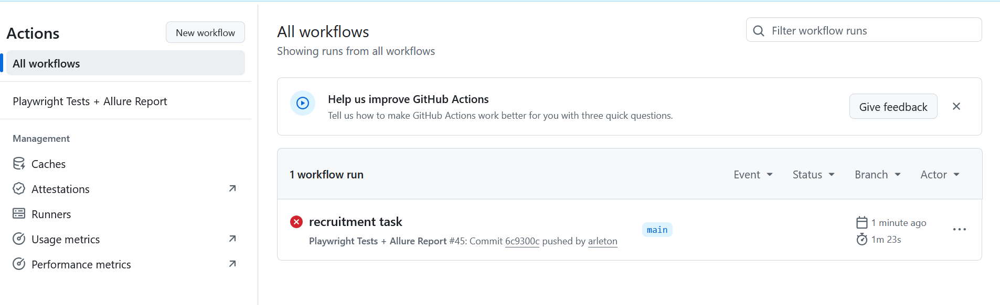

Task Rekrutacyjny - ING Polska

Projekt zawiera testy automatyczne, sprawdzające poprawność zapisu ciasteczek analitycznych. Na końcu README znajdują się opis narzędzi, wymaganych do odpalenia testów.

Dodatkowo test sprawdza:

- Widoczność logotypu ING
- Widoczność banera cookies
- Zapis ciasteczek analitycznych `_ga`, `_ga_*` po akceptacji

---URUCHAMIANIE TESTÓW---

Testy są uruchamiane w 3 przeglądarkach jednocześnie: Chromium, Firefox i WebKit.

Testy można odpalić w następujących wariantach

WARIANT 1

Można odpalić test z poziomu folderu recruitment_task za pomocą komendy .\run_tests.bat. W terminalu zostaną wyświetlone odpowiednie wyniki testów oraz dokladne nazwy ciasteczek analitycznych, aby użytkownik miał pewność że zostały dobrze pobrane.



WARIAN 2 (Z allure)

Uruchomienie z poziomu folderu recruitment_task za pomocą komendy .\run_tests_allure.bat. Po uruchomieniu testów automatycznie zostanie zainicjowna strona z wygenerowanym raportem w Allure.




WARIANT 3 - Dla właściciela repozytorium

Można uruchomić testy poprzez dokonanie jakiejkolwiek zmiany w pliku(który nie jest w gitignore), następnie wypchnąć zmiany do gałęzi main. Automatycznie zostanie uruchomiony workflow GitHub Actions, który uruchomi testy. W przypadku błędu testów zostanie wyświetlony komunikat o błędzie.



Jednakże przy odpalaniu testów CI/CD strona www.ing.pl za każdym razem wykrywa ruch bota (czyli Playwright w CI/CD) i blokuje dostęp. Testy nie przechodzą, przy próbie wejścia na stronę ING. Natomiast kod pipeline jest zrobiony:)



Struktura istonych plików projektu

```
ING
.github/
    workflows/
        playwright.yml        # kod pipeline'a
recruitment_task/
    pages/home_page.py        # Page Object dla strony ING
    tests/test_ING.py         # Główny test
    conftest.py               # Konfiguracja testów 
    pytest.ini                # Konfiguracja pytest 
    requirements.txt          # Lista zależności
    run_tests.bat             # Uruchamianie testów
    run_tests_allure.bat      # Uruchamianie testów + raport Allure
README.md                     # Dokumentacja
```

Potrzebne narzędzia do uruchomienia testów:

```
1. Zainstaluj jedną z nowszych wersji Pythona:

Pobierz z https://www.python.org.
Podczas instalacji zaznacz - Add Python to PATH
```

```
2. Zainstaluj Allure:

Pobierz Allure z GitHub:

Wejdź na: https://github.com/allure-framework/allure2/releases

Pobierz .zip → rozpakuj np. do C:\Tools\Allure

Dodaj folder bin do zmiennych środowiskowych (PATH):
np. C:\Tools\Allure\bin

Trzeba wejść do Panelu sterowania → System → Zaawansowane → Zmienne środowiskowe.

Sprawdź allure --version
```

```
3. Pobierz repozytorium i przejdź do folderu:

git clone https://github.com/arleton/task_ing.git
cd recruitment-task
```

```
4. Zainstaluj zależności:
python -m venv venv
venv\Scripts\activate
pip install --upgrade pip
pip install -r requirements.txt
playwright install
```

Można uruchomić testy według opisu na początku README.md.